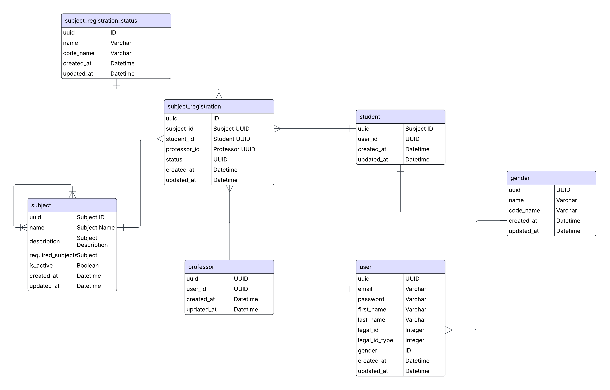

# Universidad Nacional - Alternova

<p>
<a href="https://github.com/psf/black/blob/main/LICENSE"></a>
<a href="https://github.com/psf/black"></a>
</p>

Este sistema nos permite gestionar las inscripciones de materias por parte de los estudiantes y también la calificación y gestión de materias por parte de los profesores

### Estructura del sistema

- **App users:** Gestiona y controla la logica de los usuarios del sistema.
- **App subjects:** Gestiona y controla la logica de las materias.
- **App students:** Gestiona y controla la logica de los estudiantes.
- **App professors:** Gestiona y controla la logica de los profesores.

### Instalación del sistema

1. ```git clone [this]```
2. ```python -m venv .env```
3. ```source .env/bin/activate```
4. ```pip install -r requirements.txt```
5. ```python manage.py makemigrations```
6. ```python manage.py migrate```
7. ```python manage.py runserver```

### Documentación

- **Open Swagger Docs:** ```http://localhost:8000/docs/```
- **Base de datos:** Puede abrir la carpeta ```docs/```



### Buenas prácticas

- Se usaron **Indexes** en la base de datos para optimizar las consultas.
- Se usa **Black** para formatear el código.
- Se siguió la estructura de archivos recomendada por Django.
- Se separó logica de negocio como validaciones en archivos independientes.
